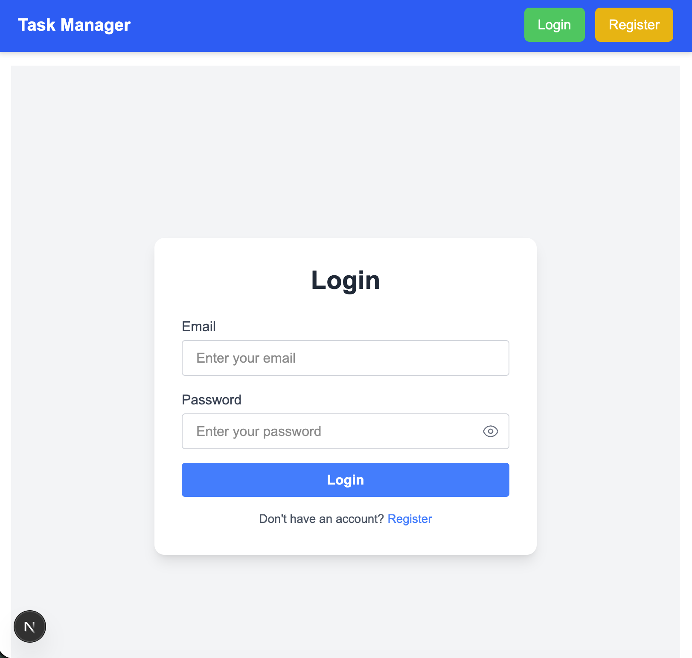
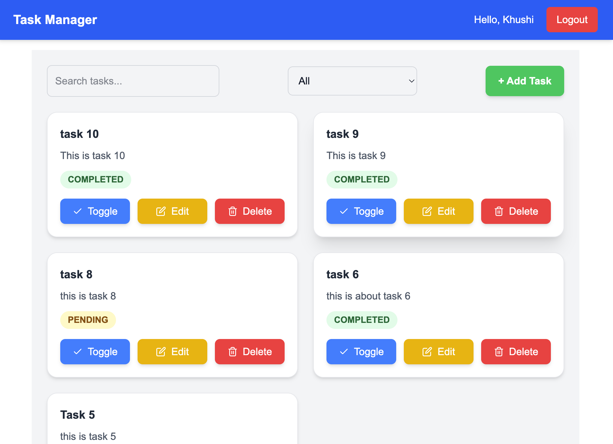
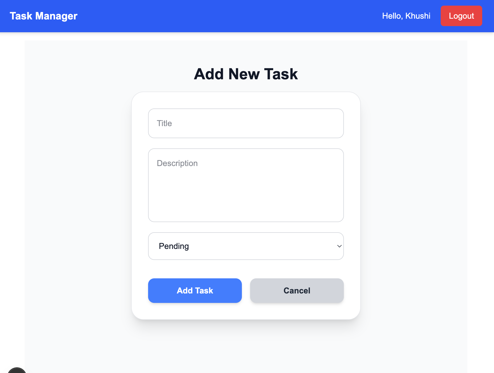

# Task Manager

[Live Demo](https://your-live-site-link.com) | [GitHub Repository](https://github.com/sharmaHarshit2000/task-manager)

---

## Description

Task Manager is a full-stack application built with **Next.js** (frontend) and **Node.js/Express** (backend) with **Prisma** as ORM and **PostgreSQL** database. It allows users to register, login, create, update, delete, and toggle tasks.

---

## Screenshots

- **Login Page**  


- **Home Page**  


- **Edit/Add Task Page**  


---

## Features

- User authentication (register/login/logout/refresh token)  
- CRUD operations on tasks  
- Toggle task status (pending/completed)  
- Protected routes with JWT authentication  

---

## Backend API Routes

### Auth Routes

| Method | Route        | Description                |
|--------|-------------|----------------------------|
| POST   | /auth/register | Register a new user       |
| POST   | /auth/login    | Login existing user      |
| POST   | /auth/refresh  | Refresh access token     |
| POST   | /auth/logout   | Logout user              |

### Task Routes (Protected)

| Method | Route                  | Description                   |
|--------|-----------------------|-------------------------------|
| POST   | /tasks                | Create a new task             |
| GET    | /tasks                | Get all tasks for the user    |
| GET    | /tasks/:id            | Get single task by ID         |
| PATCH  | /tasks/:id            | Update task details           |
| DELETE | /tasks/:id            | Delete a task                 |
| PATCH  | /tasks/:id/toggle     | Toggle task status (pending/completed) |

---

## Installation

1. Clone the repository:

```bash
git clone https://github.com/sharmaHarshit2000/task-manager.git
```

2. Install dependencies for **backend**:

```bash
cd backend
npm install
```

3. Install dependencies for **frontend**:

```bash
cd ../frontend
npm install
```

4. Create a `.env` file in backend:

```env
# DATABASE_URL="postgresql://harshitsharma:@localhost:5432/taskdb"
JWT_SECRET="supersecretkey"
PORT=5001
```

5. Run Prisma migrations and generate client:

```bash
cd backend
npx prisma migrate dev
npx prisma generate
```

6. Start the backend server:

```bash
npm run dev
```

7. Create a `.env` file in frontend:

```env
# NEXT_PUBLIC_API_BASE_URL=http://localhost:5001
```

8. Start the frontend server:

```bash
cd frontend
npm run dev
```

---

## Folder Structure

```
backend/
├─ modules/
│  ├─ auth/
│  └─ tasks/
├─ prisma/
│  └─ schema.prisma
frontend/
├─ pages/
├─ components/
```

---

## Technologies Used

- Frontend: **Next.js, React, Tailwind CSS**  
- Backend: **Node.js, Express.js, Prisma, PostgreSQL**  
- Authentication: **JWT tokens**  
- Deployment: **Vercel / Render *  

---

**Created by Harshit Sharma**

